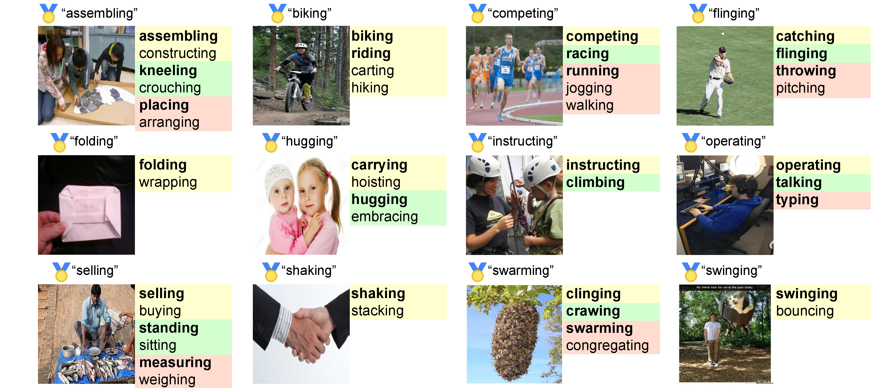

# Visually Grounded Verb Sense Clustering

**Official code for:**  
📄 *Towards Robust Evaluation of Visual Activity Recognition: Resolving Verb Ambiguity with Sense Clustering*  
**Authors**: Louie Hong Yao, Nicholas Jarvis, Tianyu Jiang  
[[arXiv link]](https://arxiv.org/abs/2508.04945) <!-- Replace with actual link -->

---

## 🔍 Overview

Evaluating visual activity recognition models is difficult due to the inherent **ambiguity in verb semantics** and **image interpretation**. For example, “teaching” and “lecturing” may both describe the same scene. Traditional evaluation using exact match against a gold label often **underestimates model performance**.

This project introduces a **two-step vision-language clustering framework** that constructs **verb sense clusters** based on multimodal embeddings from LLMs. These clusters enable **more robust and human-aligned evaluation** of activity recognition systems.

Our approach:

- Clusters ⟨image, verb⟩ pairs into fine-grained **sense groups**.
- Captures both **synonymy** and **multi-perspective interpretations**.
- Provides better alignment with **human judgment**.


## 🔍 Visual Examples
To qualitatively demonstrate the effectiveness of our clustering framework, we present the following figure with 12 randomly selected examples from the test set. Each example includes:
- The **gold label** (🏅 emoji),
- The model’s **top predictions** (shown in **bold**),
- Additional verbs within the same cluster.

Different background colors indicate separate verb sense clusters associated with the same image, capturing multiple valid ways to describe the depicted activity.





## 🛠️ Code Usage

This repository contains code for generating verb sense clusters.


### 🔧 Environment Setup

We recommend using a clean virtual environment. You can set it up using `conda`:

```bash
conda create -n verb-sense python=3.10
conda activate verb-sense
pip install -r requirements.txt
```

### 📁 Data Preparation

- **LLM Outputs**: The multimodal large language model predictions (⟨image, verb⟩ pairs) are saved in the `Data/` directory.
- **imSitu Images**: You need to manually download the images from the [imSitu project page](https://prior.allenai.org/projects/imsitu) and place them in the appropriate directory for embedding generation.

### 🧠 Step 1: Generate Embeddings

1. **Set the paths and input files** in `generate_embeddings.py`:

```python
image_folder = 'images_resized'  # Folder containing the downloaded imSitu images
outfile = 'Results/llama_504_image_verb_embeddings.json'  # Output embedding file
data = json.load(open('Data/llama_504_verbs_rows.json'))  # Image-verb pair list
```
2. **Authenticate with Hugging Face Hub** to access Llama or other hosted models:
```python
from huggingface_hub import login
login(token='YOUR_HF_TOKEN_HERE')
```

3. **Run the following script** to generate embeddings from image-verb pairs:

```bash
python generate_embeddings.py
```
This script uses a multimodal LLM Llama-3.2-11B to compute joint image-text embeddings for each ⟨image, verb⟩ pair.

### 🔍 Step 2: Run Clustering Experiments

After embeddings are generated, run the clustering pipeline with:
```bash
python experiments.py
```
Before doing so, make sure to set the correct path to the embedding file in the script:
```python
embedding_file = "path/to/your/embedding_file"
```


#### ⚠️ Embedding File Format Requirement

The embedding_file must be a Python dictionary with the following structure:
```
{
    ("verb1", "image1.jpg"): embedding_tensor1,
    ("verb2", "image2.jpg"): embedding_tensor2,
    ...
}
```
  ⚠️ Note: You will need to convert your model’s raw output into this format before running experiments.py. The conversion code is not provided to keep the repository simple, as the transformation is straightforward and depends on your specific output format.


### 📦 Outputs

- 🗂 **selected_clusters/**  
Contains the final output from the **two-step clustering pipeline**, where each file represents verb sense clusters derived from ⟨image, verb⟩ embeddings.

- 🗂 **Results/**  
Includes the **best clustering results** for the 504 imSitu target verbs, selected based on clustering quality metrics (e.g., Silhouette Score, Purity).

You can use these files directly for analysis, evaluation, or visualization.


## 📄 Citation

If you find this work useful, please consider citing:

```bibtex
@misc{yao2025robust,
      title={Towards Robust Evaluation of Visual Activity Recognition: Resolving Verb Ambiguity with Sense Clustering}, 
      author={Louie Hong Yao and Nicholas Jarvis and Tianyu Jiang},
      year={2025},
      eprint={2508.04945},
      archivePrefix={arXiv},
      primaryClass={cs.CL},
      url={https://arxiv.org/abs/2508.04945}, 
}

